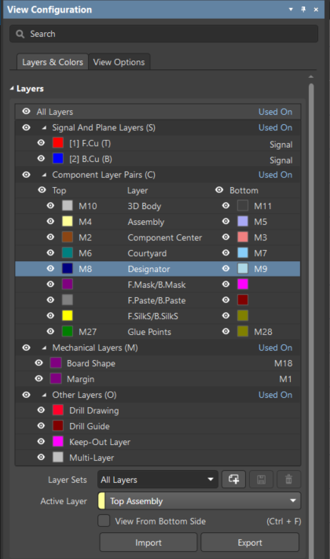

# Layer Stack Details

This document provides the **PCB layer stack** configuration and related parameters for the design.

## KiCad to Altium Layer Mapping

Below is a detailed mapping of KiCad layers to Altium layers, including the mechanical layer numbers and their respective purposes.

| KiCad Layer                      | Altium Layer          | Mechanical Layer | Purpose                              | Comments                                       |
|----------------------------------|-----------------------|------------------|--------------------------------------|------------------------------------------------|
| (None)                           | Margin                | Mechnical_M1     | (Empty)                              | OK as placeholder                              |
| F.Fab (Origin)                   | Top.Component Center  | Mechnical_M2     | Component origin for placement       | ✅ Standard practice                          |
| B.Fab (Origin)                   | Bot.Component Center  | Mechnical_M3     | Component origin for placement       | ✅ Standard practice                          |
| F.Fab                            | Top.Assembly          | Mechnical_M4     | Assembly drawing                     | ✅ Correct                                    |
| B.Fab                            | Bot.Assembly          | Mechnical_M5     | Assembly drawing                     | ✅ Correct                                    |
| F.CrtYd                          | Top.CrtYd             | Mechnical_M6     | Component clearance                  | ✅ Standard use                               |
| B.CrtYd                          | Bot.CrtYd             | Mechnical_M7     | Component clearance                  | ✅ Standard use                               |
| F.Fab (Designator)               | Top.Designator        | Mechnical_M8     | Component name (top)                 | ✅ Standard                                   |
| B.Fab (Designator)               | Bot.Designator        | Mechnical_M9     | Component name (bottom)              | ✅ Standard                                   |
| (N/A)                            | Top.3D_Body           | Mechnical_M10    | 3D body models                       | ✅ Standard in Altium                         |
| (N/A)                            | Bot.3D_Body           | Mechnical_M11    | 3D body models                       | ✅ Standard in Altium                         |
| Dwgs.User                        | Top.Dimensions        | Mechnical_M12    | Dimensions (top view)                | ⚠ Shares same layer as M12, M19              |
| Dwgs.User                        | Bot.Dimensions        | Mechnical_M13    | Dimensions (bottom view)             | ⚠ Shares same layer as M13, M19              |
| F.Fab (Value)                    | Top.Value             | Mechnical_M14    | Component values (top)               | ✅ Standard                                   |
| B.Fab (Value)                    | Bot.Value             | Mechnical_M15    | Component values (bottom)            | ✅ Standard                                   |
| Eco1.User                        | Assembly notes        | Mechnical_M16    | Assembly process notes               | ✅ Good practice                              |
| (—)                              | Board                 | Mechnical_M17    | Used as a board definition           | ⚠ Usually redundant; defined in Edge.Cuts    |
| Edge.Cuts / Board Shape          | Board_Shapes          | Mechnical_M18    | Actual board outline                 | ✅ Required for fab                           |
| Dwgs.User                        | Dimensions            | Mechnical_M19    | General layout dimensions            | ⚠ Same KiCad layer as M12, M13 → risk of overlap |
| Eco2.User                        | Fabnote               | Mechnical_M20    | Fabrication notes                    | ✅ Good practice                              |
| F.Silk                           | Top.Overlay           | Top.Overlay      | Top silkscreen                       | ✅ Standard                                   |
| B.Silk                           | Bot.Overlay           | Bot.Overlay      | Bottom silkscreen                    | ✅ Standard                                   |
| F.Paste                          | Top.Paste             | Top.Paste        | Solder paste (top)                   | ✅ Standard                                   |
| B.Paste                          | Bot.Paste             | Bot.Paste        | Solder paste (bottom)                | ✅ Standard                                   |
| F.Mask                           | Top.Solder            | Top.Solder       | Solder mask (top)                    | ✅ Standard                                   |
| B.Mask                           | Bot.Solder            | Bot.Solder       | Solder mask (bottom)                 | ✅ Standard                                   |
| (None)                           | Top.Coating           | Mechnical_M21    | Conformal coating (top)              | ✅ Advanced but common in aerospace/auto      |
| (None)                           | Bot.Coating           | Mechnical_M22    | Conformal coating (bottom)           | ✅ Advanced but common in aerospace/auto      |
| F.CrtYd                          | Top.Component Outline | Mechnical_M23    | Component outline                    | ⚠ Duplicate layer usage of F.CrtYd           |
| B.CrtYd                          | Bot.Component Outline | Mechnical_M24    | Component outline                    | ⚠ Duplicate layer usage of B.CrtYd           |
| (N/A)                            | Top.Gold Plating      | Mechnical_M25    | ENIG/gold connector                  | ✅ Excellent addition                         |
| (N/A)                            | Bot.Gold Plating      | Mechnical_M26    | ENIG/gold connector                  | ✅ Excellent addition                         |
| F.Adhes                          | Top.Glue Point        | Mechnical_M27    | Adhesive placement (top)             | ✅ Rare but valid                             |
| B.Adhes                          | Bot.Glue Point        | Mechnical_M28    | Adhesive placement (bottom)          | ✅ Rare but valid                             |
| (None)                           | V_Cut                 | Mechnical_M29    | V-scoring lines                      | ✅ Important for panelization                 |
| Edge.Cuts / Board Shape          | Root_ToolPath         | Mechnical_M30    | Routing or milling path              | ✅ Standard fab layer                         |
| (None)                           | Sheet                 | Mechnical_M31    | Unknown purpose                      | ⚠ Undefined – clarify use                    |
| Cmts.User                        |                       | Mechnical_M32    |                                      |                                                |

---

## PCB Stack-Up Diagram

Below is the visual representation of the **PCB stack-up** showing the layers:

---

## Altium View Configuration

---

For more details on configuring the layer stack in Altium, refer to the Altium documentation or the repository's main README.

